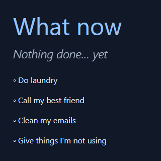

# What Now

> Minimalist task coach

## What is it ?

This app is a minimalist todo list based on recurring tasks.

For example here "Call my best friend" is a weekly task, it was displayed because the task was not done since 7 days or more. Then you marked it has done, you can see the green mark.

Tomorrow the task will be hidden for the next 7 days. This mechanism allows two things :

- see the tasks completed for the current day
- focus on the remaining tasks only

Like this you can have daily, weekly, monthly tasks or even custom recurring delays like : every X days or month, etc.

## How it differs from basic todo apps ?

This app :

- totally free, no hidden costs or "pro"/"premium" things
- open source and does not use analytics or trackers
- focus on simplicity
- works on desktop, tablets, mobile
- let you setup recurring tasks to free your head

If you find an other app like this, then it does not differs :D

Else enjoy it, you can even contribute to make it better !

## How does it work ?

The tasks are stored on [Airtable](https://airtable.com/invite/r/haFeqo8t), it's a great service like Google Spreadsheet but with way more functionalities.

I created a free demo account on Airtable so you can understand how is works :

- This table with recurring tasks : [https://airtable.com/shreHMPG1ZtgmT5az](https://airtable.com/shreHMPG1ZtgmT5az)
- Render like this in What-now : [https://what-now.netlify.app/#appQaesCng5o5xqE2&keyvPT7WLHLud5ZnX](https://what-now.netlify.app/#appQaesCng5o5xqE2&keyvPT7WLHLud5ZnX) (credentials from the demo account are passed in parameters)

## How can I have mine ?

1. Create a [Airtable](https://airtable.com/invite/r/haFeqo8t) free account
2. Open this [sample table](https://airtable.com/shrYQeD7BurQgyQz3), on the top right click "copy base" so you have your private copy of this to start
3. Go to [What Now](https://what-now.netlify.app) and type your credentials, see the related links in the form to help you find your own credentials

Tadaa ! You should see your todo list appearing, you can now fill your tasks in Airtable, return to What-Now should trigger a sync.

Your data will stay between you and Airtable, your credentials will be stored in the local storage of your browser to let you close the what-now tab and re-open it later without the need to fill your credentials again.

You can have a look at the sources to see that this app is not sharing your data with anyone, no analytics, trackers or other annoying things.

## TODO

- [ ] reactivate this lint rule : no-param-reassign
- [ ] try to use reefjs.com on this project

## Benchmarks

### Build ts sources to js

- 5,3 seconds with poi
- 0,9 seconds with tsup :tada:
- 0,8 seconds with esbuild :tada:

### Build Tailwind styles

- 1,9 seconds with tailwindcss & jit
- instant with twind

## Thanks

- [C8](https://github.com/bcoe/c8) : simple & effective cli for code coverage
- [Canvas-Confetti](https://github.com/catdad/canvas-confetti) : superb fireworks/confetti effets
- [Dependency-cruiser](https://github.com/sverweij/dependency-cruiser) : handy tool to validate and visualize dependencies
- [Esbuild](https://github.com/evanw/esbuild) : an extremely fast JavaScript bundler and minifier
- [Eslint](https://eslint.org) : super tool to find & fix problems
- [Favicon.io](https://favicon.io) : cool favicon generator
- [Florian Reichelt](https://freesound.org/people/florianreichelt/sounds/459973/) : fireworks sound effect hosted on FreeSound
- [Github](https://github.com) : for all their great work year after year, pushing OSS forward
- [Netlify](https://netlify.com) : awesome company that offers free CI & hosting for OSS projects
- [Npm-parallel](https://github.com/spion/npm-parallel) : to keep my npm scripts clean & readable
- [Repo-checker](https://github.com/Shuunen/repo-checker) : eslint cover /src code and this tool the rest ^^
- [Servor](https://github.com/lukejacksonn/servor) : dependency free dev server for single page app development
- [Shields.io](https://shields.io) : nice looking badges to be proud of
- [Shuutils](https://github.com/Shuunen/shuutils) : collection of pure JS utils
- [TailwindCss](https://tailwindcss.com) : awesome lib to produce maintainable style
- [Vitest](https://github.com/vitest-dev/vitest) : super fast vite-native testing framework
- [Watchlist](https://github.com/lukeed/watchlist) : recursively watch a list of directories & run a command on any file system
